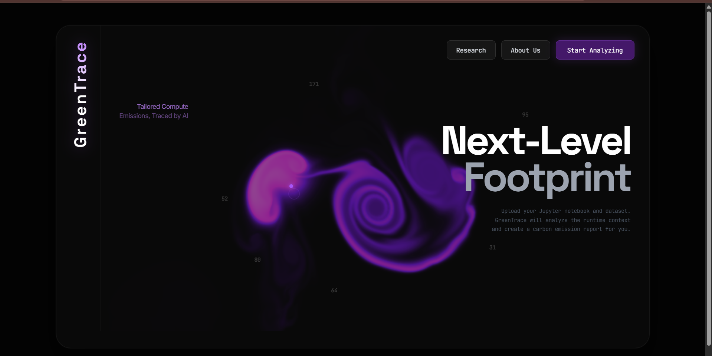
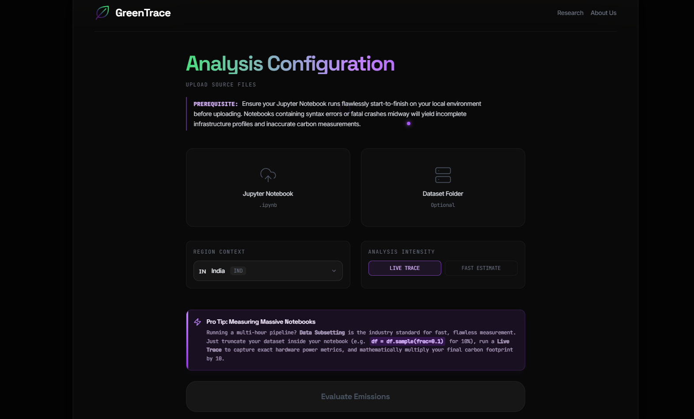
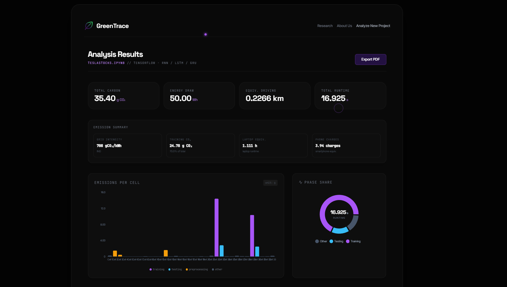

# GreenTrace — Next-Level Footprint

**Live Application: [green-trace-next-level-footprint.vercel.app](https://green-trace-next-level-footprint.vercel.app)**

**GreenTrace** is a carbon footprint analyzer built for machine learning practitioners. It accepts any Jupyter Notebook and produces a granular, per-cell carbon emission report — broken down by CPU, RAM, and GPU energy draw — combined with AI-generated optimization recommendations to help developers reduce the environmental cost of their code without sacrificing performance.

---

## Table of Contents

- [Overview](#overview)
- [Screenshots](#screenshots)
- [Architecture](#architecture)
- [Features](#features)
- [Analysis Modes](#analysis-modes)
- [Tech Stack](#tech-stack)
- [Project Structure](#project-structure)
- [Deployment](#deployment)
- [Getting Started](#getting-started)
  - [Prerequisites](#prerequisites)
  - [Backend Setup](#backend-setup)
  - [Frontend Setup](#frontend-setup)
  - [Environment Variables](#environment-variables)
- [API Reference](#api-reference)
- [Carbon Calculation Methodology](#carbon-calculation-methodology)
- [Research Foundation](#research-foundation)
- [Grid Regions Supported](#grid-regions-supported)
- [Infrastructure and Limitations](#infrastructure-and-limitations)
- [License](#license)

---

## Overview

As machine learning models grow exponentially in size, the energy required to train them grows in parallel. The global ML community accelerated from roughly 1,350 deep learning publications in 2015 to over 85,000 in 2022 — and the computational overhead has scaled accordingly. Training a single state-of-the-art model can emit hundreds of tonnes of CO2 equivalent, placing AI development in direct tension with climate sustainability goals.

GreenTrace addresses this problem by making carbon measurement a first-class citizen of the ML development workflow. Rather than estimating emissions at a coarse pipeline level, GreenTrace instruments execution at the individual notebook cell — giving practitioners the precision to identify exactly which training loop, data loading block, or inference call is responsible for the largest share of their computational footprint.

The platform is free to use and is deployed as a full-stack web application with a React frontend and a FastAPI backend.

---

## Screenshots

**Landing Page**



The landing page features a real-time WebGL fluid simulation as its central visual element, with dark glassmorphism styling and primary navigation to the analyzer, the research article, and the About Us section.

---

**Analysis Configuration**



The upload interface allows users to drop a Jupyter Notebook file and an optional dataset folder, select a geographic grid region for accurate carbon intensity values, and toggle between Live Trace and Fast Estimate modes before submitting.

---

**Results Dashboard**



The results dashboard presents total CO2 and energy figures, a per-cell breakdown table with training/testing/preprocessing classification badges, a phase-level emissions pie chart, real-world equivalences, and the full AI optimization report — all exportable as a PDF.

---

## Architecture

```
GreenTrace
├── backend/                  FastAPI application
│   ├── main.py               Entry point, CORS, router registration
│   ├── routers/
│   │   ├── analyze.py        POST /api/analyze, GET /api/status/{job_id}
│   │   └── report.py         GET /api/report/{job_id} (PDF download)
│   ├── core/
│   │   ├── notebook_runner.py    Live kernel execution, hardware profiling
│   │   ├── static_analyzer.py   AST-based framework and cell classification
│   │   ├── carbon_calculator.py Emission aggregation and equivalences
│   │   ├── path_resolver.py     Dataset path resolution for uploaded files
│   │   └── pdf_generator.py     ReportLab PDF report generator
│   ├── rag/
│   │   └── groq_client.py       Groq LLM integration for AI recommendations
│   └── models/
│       └── schemas.py           Pydantic data models
│
└── frontend/                 React + Vite application
    └── src/
        ├── App.jsx               Root component, routing state, API calls
        ├── components/
        │   ├── Landing.jsx       Hero page with WebGL fluid simulation
        │   ├── UploadZone.jsx    Notebook/dataset upload form, region selector
        │   ├── Dashboard.jsx     Results visualization, charts, AI panel
        │   ├── Research.jsx      Long-form research article on Green AI
        │   ├── AboutUs.jsx       Platform documentation and FAQ
        │   ├── FluidSimulation.jsx  WebGL fluid dynamics renderer
        │   ├── ParticleCanvas.jsx   Canvas particle background
        │   └── CustomCursor.jsx     Custom cursor animation
        └── assets/
            └── logo.png
```

---

## Features

**Per-Cell Carbon Profiling**
Each Jupyter Notebook cell is executed in isolation. CPU power draw, RAM consumption, and GPU voltage are measured in real time and multiplied by the grid carbon intensity of the selected geographic region to produce a gCO2 figure per cell.

**Two Analysis Modes**
Live Trace and Fast Estimate serve different stages of the development workflow. Live Trace requires actual notebook execution and produces hardware-accurate readings. Fast Estimate parses the notebook's Abstract Syntax Tree without executing code and returns instant structural estimates.

**Framework and Model Detection**
The static analyzer automatically detects the ML framework in use (PyTorch, TensorFlow, Keras, scikit-learn, HuggingFace Transformers, XGBoost, LightGBM, JAX, FastAI) and identifies the model architecture (CNN, Transformer, RNN/LSTM, MLP, GAN, Diffusion, and more) to inform complexity-based FLOP estimation.

**Cell Classification**
Every code cell is automatically classified as training, testing, preprocessing, or other based on pattern matching against known API signatures — enabling a phase-level breakdown of where emissions are concentrated across the pipeline.

**AI-Powered Optimization Recommendations**
After analysis, the platform queries the Groq LLM API with the notebook's structure, detected framework, highest-emission cells, and measured metrics. The model returns a plain-English summary of environmental efficiency and a ranked list of concrete optimization suggestions — such as switching to mixed-precision training (fp16), fixing inefficient data loaders, or recommending hardware accelerators — each with an estimated energy savings percentage.

**Region-Aware Grid Carbon Intensity**
Users select their geographic region before analysis. The backend applies the corresponding marginal grid carbon intensity in gCO2/kWh to all energy measurements, ensuring that a notebook run in France (85 g/kWh nuclear-heavy grid) is correctly distinguished from one run in India (708 g/kWh coal-heavy grid).

**Real-World Equivalences**
Total emissions are translated into human-scale comparisons: kilometres driven by an average petrol car, hours of laptop use, and number of smartphone charges — using emission constants sourced from the EPA, Our World in Data, and the IEA.

**PDF Export**
Every completed analysis generates a downloadable, audit-ready PDF report containing the complete cell-by-cell breakdown, CPU/RAM/GPU splits, phase-level pie chart, hardware metadata, real-world equivalences, and all AI recommendations ranked by impact.

**Graceful Crash Recovery**
If a cell throws a runtime error during Live Trace, GreenTrace does not abort the entire session. It catches the exception, saves all measurements recorded up to that point, and flags the offending cell with a warning in the dashboard — ensuring a partial report is always recoverable.

**Asynchronous Job Processing**
Long-running notebook executions are processed as background jobs. The frontend submits the analysis request, receives a job ID, and polls the `/api/status/{job_id}` endpoint at three-second intervals until the job completes or fails.

---

## Analysis Modes

### Live Trace

Live Trace is the highest-fidelity mode. GreenTrace executes the notebook cell by cell inside a managed Jupyter kernel on the backend server, measuring hardware state before and after each cell execution.

- **Local deployment**: Uses Intel RAPL (Running Average Power Limit) hardware counters accessed directly from the host filesystem for micro-joule-accurate CPU and package power readings.
- **Cloud deployment**: Free-tier cloud containers block access to physical hardware sensors. The fallback reads process-level CPU utilization via `psutil` and multiplies by a hardware TDP (Thermal Design Power) profile constant. This accurately ranks cells relative to each other but produces estimated absolute CO2 values with a variance of approximately 10–30%.
- Requires the notebook to run without errors on the user's local machine before upload.
- Dataset files uploaded alongside the notebook are path-resolved internally so notebook file references continue to work within the execution environment.

### Fast Estimate

Fast Estimate performs pure static analysis using Python's `ast` module. No code is executed.

- Parses the Abstract Syntax Tree of every code cell.
- Classifies cells as training, testing, preprocessing, or other based on recognized API call patterns.
- Detects the ML framework and model architecture and maps them to a complexity tier (light, medium, heavy, very heavy) with corresponding estimated FLOP counts.
- Applies TDP-based energy formulas to produce estimated cell-level emissions.
- Produces identical results whether run locally or on the cloud — results are mathematically deterministic and sensor-independent.
- Results are instant; no dataset upload is required.

---

## Tech Stack

### Backend

| Component | Technology |
|---|---|
| API Framework | FastAPI 0.111+ |
| ASGI Server | Uvicorn with standard extras |
| Notebook Execution | `jupyter_client`, `ipykernel`, `nbformat`, `nbconvert` |
| Carbon Tracking | CodeCarbon 2.4+ |
| Hardware Profiling | `psutil`, Intel RAPL (local) |
| Static Analysis | Python `ast` module, `nbformat` |
| AI / LLM | Groq API (`groq` SDK) |
| PDF Generation | ReportLab 4.2+ |
| Data Validation | Pydantic v2 |
| Environment Config | `python-dotenv` |
| Additional Libs | `matplotlib`, `numpy`, `pandas`, `scipy`, `scikit-learn`, `seaborn`, `plotly`, `xgboost`, `statsmodels`, `yfinance` |

### Frontend

| Component | Technology |
|---|---|
| Framework | React 18 with Vite |
| Styling | Tailwind CSS |
| HTTP Client | Axios |
| Icons | Lucide React |
| Visualization | WebGL (custom FluidSimulation), Canvas API |
| Typography | Syne (Google Fonts), system monospace |
| State Management | React `useState` (component-local) |

---

## Project Structure

```
github_repo/
├── backend/
│   ├── .env.example              Environment variable template
│   ├── main.py                   FastAPI app, CORS, router mounts
│   ├── requirements.txt          Python dependencies
│   ├── routers/
│   │   ├── __init__.py
│   │   ├── analyze.py            Analysis endpoints
│   │   └── report.py             PDF download endpoint
│   ├── core/
│   │   ├── __init__.py
│   │   ├── notebook_runner.py    Kernel execution and hardware profiling
│   │   ├── static_analyzer.py    AST analysis, framework/model detection
│   │   ├── carbon_calculator.py  Emission aggregation and equivalences
│   │   ├── path_resolver.py      Dataset path resolution
│   │   └── pdf_generator.py      PDF report generation
│   ├── rag/
│   │   ├── __init__.py
│   │   └── groq_client.py        Groq LLM client, prompt construction
│   ├── models/
│   │   └── schemas.py            Pydantic schemas (CellEmission, EmissionSummary, etc.)
│   └── test_*.py                 Backend unit and integration tests
│
├── frontend/
│   ├── package.json
│   ├── vite.config.js
│   ├── index.html
│   └── src/
│       ├── main.jsx
│       ├── App.jsx
│       ├── App.css
│       ├── index.css
│       ├── assets/
│       │   └── logo.png
│       └── components/
│           ├── Landing.jsx
│           ├── UploadZone.jsx
│           ├── Dashboard.jsx
│           ├── Research.jsx
│           ├── AboutUs.jsx
│           ├── FluidSimulation.jsx
│           ├── ParticleCanvas.jsx
│           └── CustomCursor.jsx
│
├── docs/
│   └── images/                   UI screenshots for documentation
├── format.py                     Code formatting utility
└── README.md
```

---

## Deployment

The application is live and publicly accessible. No installation or account is required.

| Service | URL | Platform |
|---|---|---|
| Frontend | [green-trace-next-level-footprint.vercel.app](https://green-trace-next-level-footprint.vercel.app) | Vercel |
| Backend API | Deployed on Render (free tier) | Render |
| API Docs | Available at `/docs` on the backend URL | FastAPI Swagger UI |

The frontend is continuously deployed from the `main` branch. The backend runs on Render's free tier, which means the first request after a period of inactivity may take 30–60 seconds while the service cold-starts.

---

## Getting Started

### Prerequisites

- Python 3.10 or higher
- Node.js 18 or higher and npm
- A Groq API key (free tier available at [console.groq.com](https://console.groq.com))
- Git

### Backend Setup

```bash
# Navigate to the backend directory
cd backend

# Create and activate a virtual environment
python -m venv venv

# On Windows
venv\Scripts\activate

# On macOS / Linux
source venv/bin/activate

# Install dependencies
pip install -r requirements.txt

# Copy the environment template and fill in your values
copy .env.example .env     # Windows
cp .env.example .env       # macOS / Linux

# Start the development server
python main.py
```

The backend will start on `http://localhost:8000`. The interactive API documentation is available at `http://localhost:8000/docs`.

### Frontend Setup

```bash
# Navigate to the frontend directory
cd frontend

# Install dependencies
npm install

# Create a .env file for the frontend
echo VITE_API_URL=http://localhost:8000 > .env

# Start the Vite development server
npm run dev
```

The frontend will be available at `http://localhost:5173`.

### Environment Variables

#### Backend (`backend/.env`)

| Variable | Description | Required |
|---|---|---|
| `GROQ_API_KEY` | Groq API key for AI recommendations. Obtain from `console.groq.com`. | Yes |
| `CHROMA_PATH` | Path for ChromaDB persistence directory. Defaults to `./chroma_db`. | No |
| `FRONTEND_URL` | Frontend origin for CORS. Defaults to `http://localhost:5173`. | No |

#### Frontend (`frontend/.env`)

| Variable | Description | Required |
|---|---|---|
| `VITE_API_URL` | Full URL of the backend API. Defaults to `http://localhost:8000`. | Yes |

---

## API Reference

### POST `/api/analyze`

Submits a notebook for analysis. Accepts `multipart/form-data`.

**Request fields**

| Field | Type | Description |
|---|---|---|
| `notebook` | File | The Jupyter Notebook file (`.ipynb`). Required. |
| `dataset` | File (multiple) | Dataset files. Optional. Up to 1,000 files. |
| `dataset_paths` | String (JSON) | JSON array of relative file paths corresponding to the dataset uploads. |
| `region` | String | Grid region code. One of `IND`, `USA`, `DEU`, `FRA`, `JPN`. |
| `run_live` | Boolean | `true` for Live Trace, `false` for Fast Estimate. |

**Response**

If the job completes synchronously:
```json
{
  "status": "completed",
  "result": { ... }
}
```

If the job is queued for asynchronous execution:
```json
{
  "status": "processing",
  "job_id": "uuid-string"
}
```

### GET `/api/status/{job_id}`

Polls the status of an asynchronous analysis job.

**Response**
```json
{
  "status": "completed | processing | failed",
  "result": { ... },
  "error": "error message if failed"
}
```

### GET `/api/report/{job_id}`

Downloads the completed analysis as a PDF report.

**Response**: `application/pdf` binary stream.

---

## Carbon Calculation Methodology

Emission calculations follow a three-stage pipeline:

**Stage 1 — Energy Measurement**

For Live Trace, the backend reads CPU power in watts from Intel RAPL counters (locally) or from `psutil` CPU percent multiplied by hardware TDP constants (cloud). Energy in kilowatt-hours is computed as:

```
energy_kwh = (power_watts * duration_seconds) / 3_600_000
```

**Stage 2 — CO2 Conversion**

The energy figure is multiplied by the marginal carbon intensity of the selected geographic grid:

```
co2_grams = energy_kwh * grid_intensity_gCO2_per_kWh
```

**Stage 3 — Real-World Equivalences**

Total emissions are converted using constants sourced from the EPA and IEA:

| Equivalence | Constant | Source |
|---|---|---|
| Kilometres driven | 6.4 km per kg CO2 (avg petrol car at 156 gCO2/km) | EPA |
| Laptop hours | 45 W average TDP | IEA |
| Smartphone charges | 12.68 Wh per charge (3220 mAh x 3.93 V) | IEA |

All values are stored at 8 significant figures of precision. Display rounding is handled entirely on the frontend.

---

## Research Foundation

The Research page embedded in the application documents the empirical study that motivated GreenTrace. The study trained a convolutional neural network for dementia MRI classification across five experimental setups to quantify how different data preparation strategies affect both diagnostic accuracy and operational carbon emissions.

**Experimental Setups**

| Setup | Configuration | Carbon Impact |
|---|---|---|
| 1 | Baseline — raw original dataset only | Lowest baseline emissions, model limited by class imbalance |
| 2 | GAN augmentation across entire dataset (train + val + test) | Massive carbon spike; clinically invalid due to synthetic test data |
| 3 | GAN augmentation on training set only | Improved clinical validity; GAN training overhead remained prohibitive |
| 4 | Classical augmentation on training set only | Significant carbon reduction; full data authenticity preserved |
| 5 | Classical augmentation across entire dataset | Best overall configuration — lowest carbon, highest generalization |

**Key Conclusions**

- Classical geometric augmentation (rotation, scaling, contrast shifting) preserves full anatomical authenticity and runs at a fraction of the energy cost of generative adversarial training.
- GANs introduce severe clinical risks in medical imaging: they can hallucinate synthetic pathological features that look valid to a classifier but contradict real human anatomy.
- Fine-tuning pre-trained models consistently outperforms training from scratch in both accuracy and computational efficiency.
- The optimal sustainable ML pipeline combines classical data augmentation with transfer learning fine-tuning.

The research article covers carbon footprint theory, the taxonomy of direct versus indirect (embodied) emissions, the role of cloud computing geography and time-of-day scheduling in marginal carbon intensity, and the D-CAIS dual-governance framework for AI sustainability.

---

## Grid Regions Supported

| Region Code | Country | Grid Intensity |
|---|---|---|
| `IND` | India | 708 gCO2/kWh |
| `USA` | United States | 386 gCO2/kWh |
| `DEU` | Germany | 400 gCO2/kWh |
| `FRA` | France | 85 gCO2/kWh |
| `JPN` | Japan | 450 gCO2/kWh |

Grid intensity values are sourced from national energy authority data and represent marginal average intensities. France's notably low value reflects its high proportion of nuclear generation. India's high value reflects the current dominance of coal-fired generation in its mix.

---

## Infrastructure and Limitations

**Free Public Deployment**

GreenTrace is deployed entirely for free using shared cloud infrastructure. The following constraints apply to the public deployment:

- **Sensor access**: Cloud containers block access to physical motherboard hardware sensors (Intel RAPL, GPU voltage rails) for security isolation reasons. Live Trace on the cloud uses `psutil`-based CPU utilization multiplied by a TDP constant as a fallback. This accurately ranks cells by relative energy cost but produces absolute CO2 values with a typical variance of 10–30% compared to bare-metal physical measurement.
- **Dataset size limit**: Datasets are strictly capped at 1,000 files to prevent shared server resource exhaustion. For larger pipelines, subset the data inside the notebook (e.g. `df = df.sample(frac=0.1)`) and multiply the resulting carbon figure by the inverse of the sampling fraction.
- **Fast Estimate accuracy**: Identical locally and on the cloud. Static AST analysis is mathematically deterministic and hardware-independent.

**Enterprise Roadmap**

The next phase of GreenTrace targets dedicated bare-metal server hosting. On bare-metal infrastructure, physical motherboard sensors are fully accessible, producing 100% physically accurate, auditable emission figures suitable for ESG compliance reporting. Hardware-level GPU power rail monitoring would also be enabled, providing complete CPU + RAM + GPU per-cell breakdowns with no estimation fallback.

---

## License

This project was developed as part of academic research work at the undergraduate level in Cloud Computing. All source code is the original work of the contributors.

---

*GreenTrace — Carbon-Aware Computing Platform — v1.0 — Built to democratize sustainable AI development.*
